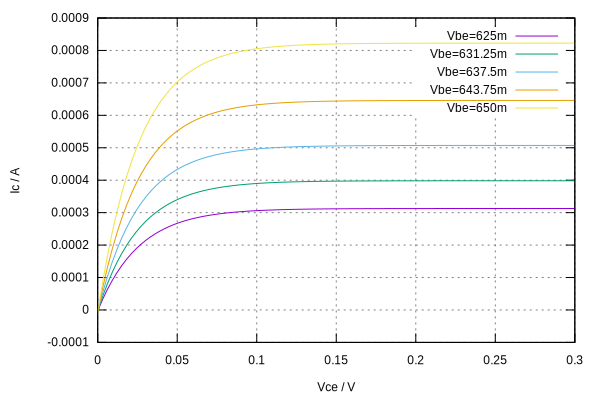
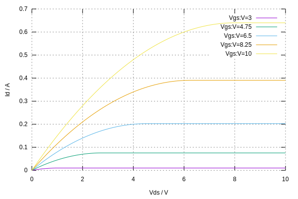
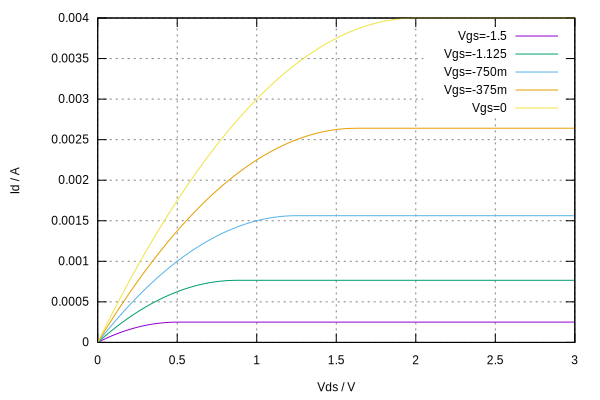
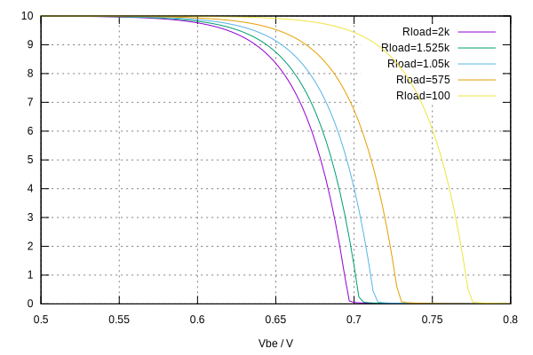
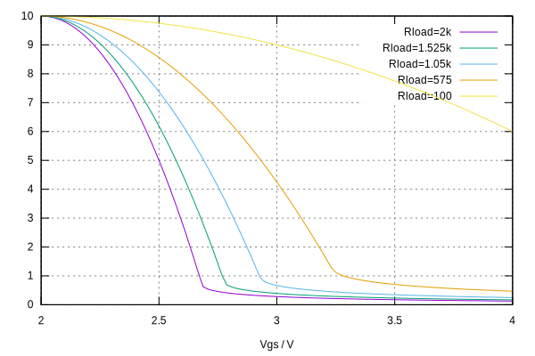

# Electronic Circuit Simulator

**jssim** is an electronic circuit simulator written in TypeScript.

## Example

The following code

```typescript
// Create an empty circuit.
const circuit = new Circuit();

// Allocate circuit nodes.
const GND = circuit.groundNode;
const N1 = circuit.makeNode("N1");
const N2 = circuit.makeNode("N2");

// Create devices.
const V1 = new VSource("V1", [N1, GND]);
const R1 = new Resistor("R1", [N1, N2]);
const D1 = new Diode("D1", [N2, GND]);

// Set device properties.
V1.properties.set("V", 10);
R1.properties.set("R", 1000);
D1.properties.set("temp", 26.85);

// Add devices to the circuit.
circuit.addDevice(V1);
circuit.addDevice(R1);
circuit.addDevice(D1);

// Perform DC analysis, compute node voltages and branch currents.
new DcAnalysis().run(circuit);

// Print the operating points.
console.log(dumpCircuit(circuit));
```

prints the following result

```typescript
[
  'V(N1)=10V', // voltage at node N1
  'V(N2)=712.41mV', // voltage at node N2
  'V1{V=10V,I=-9.288mA,P=-92.876mW}', // voltage source output params
  'R1{V=9.288V,I=9.288mA,P=86.259mW}', // resistor output params
  'D1{V=712.41mV,I=9.288mA,P=6.617mW}' // diode output params
];
```

## Interactive Shell

An [interactive shell](https://aradzie.github.io/jssim/) is available to play with netlists.

## Virtual Curve Tracer

The following non-linear device I/V curves were obtained from the simulator.

### Diode I/V Curve


### BJT I/V Curve



### MOSFET I/V Curve



### JFET I/V Curve



### BJT Amplifier I/V Curve



### MOSFET Amplifier I/V Curve



# License

This program is free software; you can redistribute it and/or modify it under
the terms of the GNU General Public License as published by the Free Software
Foundation; either version 2 of the License, or (at your option) any later
version.

This program is distributed in the hope that it will be useful, but WITHOUT ANY
WARRANTY; without even the implied warranty of MERCHANTABILITY or FITNESS FOR A
PARTICULAR PURPOSE. See the GNU General Public License for more details.

You should have received a copy of the GNU General Public License along with
this program; if not, write to the Free Software Foundation, Inc., 51 Franklin
Street, Fifth Floor, Boston, MA 02110-1301, USA.
