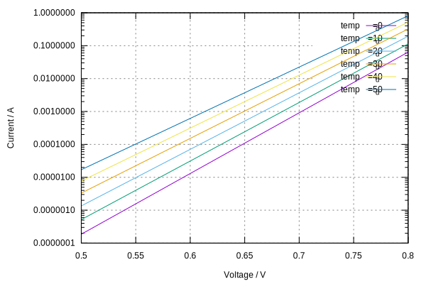

# Electronic Circuit Simulator

**jecs** is an electronic circuit simulator written in TypeScript.

## Example

The following code

```typescript
// Create an empty circuit.
const circuit = new Circuit();

// Allocate circuit nodes.
const GND = circuit.groundNode;
const N1 = circuit.makeNode("N1");
const N2 = circuit.makeNode("N2");

// Create devices.
const V1 = new Vdc("V1");
const R1 = new Resistor("R1");
const D1 = new Diode("D1");

// Connect devices in the circuit.
circuit.connect(V1, [N1, GND]);
circuit.connect(R1, [N1, N2]);
circuit.connect(D1, [N2, GND]);

// Set device properties.
V1.properties.set("V", 10);
R1.properties.set("R", 1000);
D1.properties.set("temp", 26.85);

// Perform DC analysis, compute node voltages and branch currents.
const analysis = new DcAnalysis();
analysis.properties.set("maxIter", 10);
analysis.properties.set("abstol", 1e-12);
analysis.properties.set("vntol", 1e-6);
analysis.properties.set("reltol", 1e-3);
analysis.run(circuit);

// Print the operating points.
console.log(dumpCircuit(circuit));
```

prints the following result

```typescript
[
  "V(N1)=10V", // voltage at node N1
  "V(N2)=712.407mV", // voltage at node N2
  "V1{V=10V,I=-9.288mA,P=-92.876mW}", // voltage source output params
  "R1{V=9.288V,I=9.288mA,P=86.259mW}", // resistor output params
  "D1{V=712.407mV,I=9.288mA,P=6.617mW}", // diode output params
];
```

## Interactive Shell

An [interactive shell](https://aradzie.github.io/jecs/) is available to play with netlists.

## Virtual Curve Tracer

The following non-linear device I/V curves were obtained from the simulator.

### Diode I/V Curve



### BJT I/V Curve


### MOSFET I/V Curve


### JFET I/V Curve


### BJT Amplifier I/V Curve


### MOSFET Amplifier I/V Curve


# License

This program is free software; you can redistribute it and/or modify it under
the terms of the GNU General Public License as published by the Free Software
Foundation; either version 2 of the License, or (at your option) any later
version.

This program is distributed in the hope that it will be useful, but WITHOUT ANY
WARRANTY; without even the implied warranty of MERCHANTABILITY or FITNESS FOR A
PARTICULAR PURPOSE. See the GNU General Public License for more details.

You should have received a copy of the GNU General Public License along with
this program; if not, write to the Free Software Foundation, Inc., 51 Franklin
Street, Fifth Floor, Boston, MA 02110-1301, USA.
