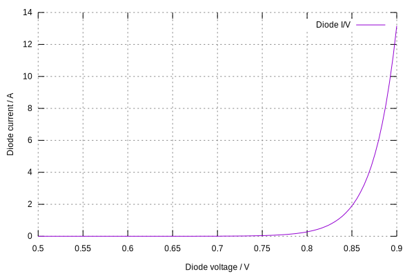
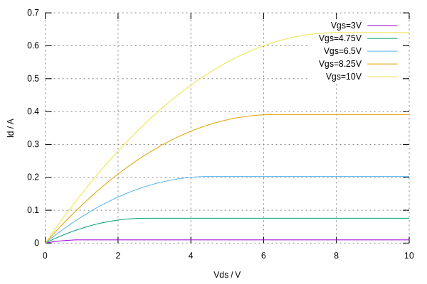
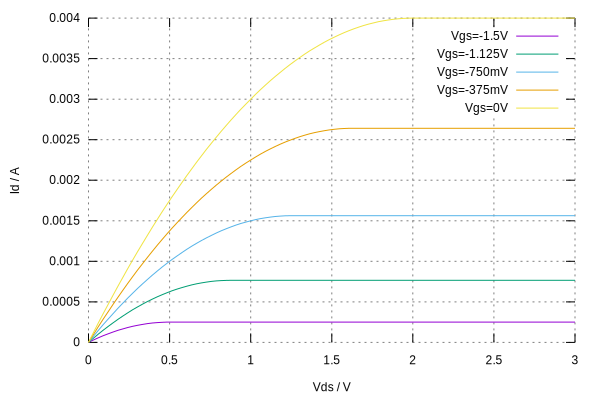
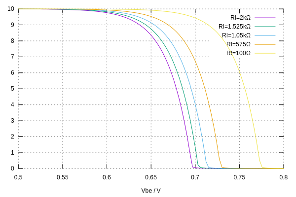
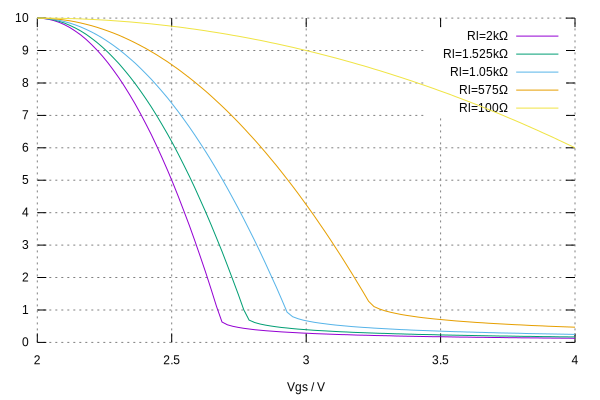

# Electronic Circuit Simulator

jssim is an electronic circuit simulator written in TypeScript.

## Example

The following code

```typescript
// Create an empty circuit.
const circuit = new Circuit();

// Allocate circuit nodes.
const ng = circuit.groundNode;
const n1 = circuit.makeNode("N1");
const n2 = circuit.makeNode("N2");

// Add devices to the circuit.
circuit.addDevice(
  new VSource("V1", [n1, ng], {
    V: 10,
  }),
  new Resistor("R1", [n1, n2], {
    R: 1000,
  }),
  new Diode("D1", [n2, ng], {
    Is: 1e-14,
    N: 1,
    Temp: 26.85,
  }),
);

// Perform DC analysis, compute node voltages and branch currents.
dcAnalysis(circuit);

// Print the operating points.
console.log(dumpCircuit(circuit));
```

prints the following result

```typescript
[
  "V(N1)=10V", // voltage at node N1
  "V(N2)=712.41mV", // voltage at node N2
  "V1{V=10V,I=-9.288mA,P=-92.876mW}", // voltage source output params
  "R1{V=9.288V,I=9.288mA,P=86.259mW}", // resistor output params
  "D1{V=712.41mV,I=9.288mA,P=6.617mW}", // diode output params
];
```

## Virtual Curve Tracer

The following non-linear device I/V curves were obtained from the simulator.

### Diode I/V Curve



### BJT I/V Curve


### MOSFET I/V Curve



### JFET I/V Curve



### BJT Amplifier I/V Curve



### MOSFET Amplifier I/V Curve



# License

This program is free software; you can redistribute it and/or modify it under
the terms of the GNU General Public License as published by the Free Software
Foundation; either version 2 of the License, or (at your option) any later
version.

This program is distributed in the hope that it will be useful, but WITHOUT ANY
WARRANTY; without even the implied warranty of MERCHANTABILITY or FITNESS FOR A
PARTICULAR PURPOSE. See the GNU General Public License for more details.

You should have received a copy of the GNU General Public License along with
this program; if not, write to the Free Software Foundation, Inc., 51 Franklin
Street, Fifth Floor, Boston, MA 02110-1301, USA.
